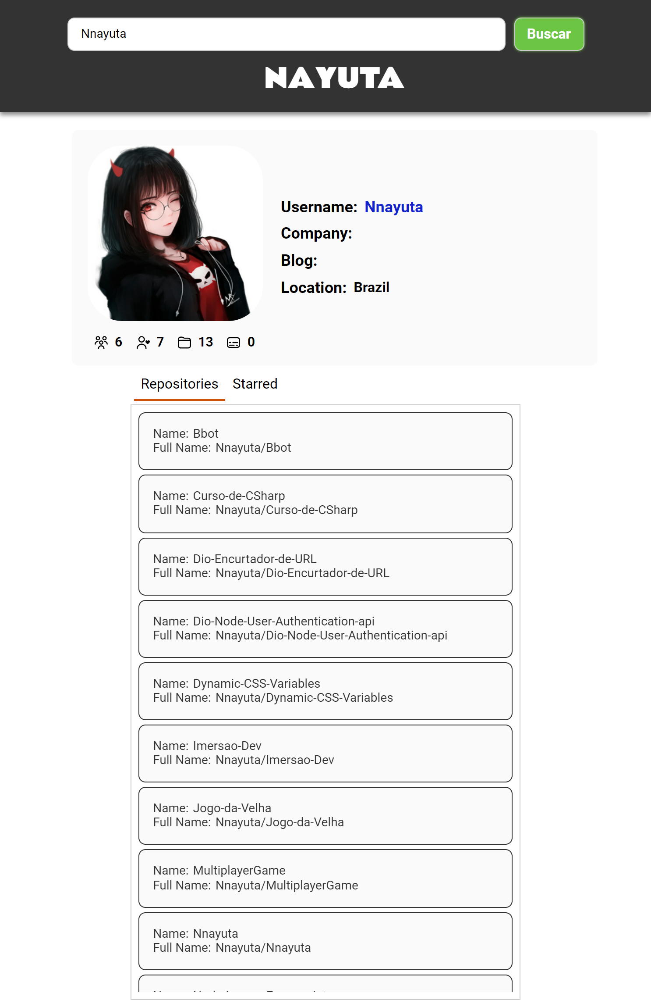

# Projeto "Criando um front-end totalmente componetizado com React"

## Objetivo
O objetivo do projeto é criar um front-end totalmente componetizado com React e utilizando a api do [Github](https://api.github.com/).

## Como funciona

+ Pesquisa por um usuário no Github
+ Pesquisa os repositórios do usuário
+ Pesquisa os repositórios do usuário com estreas

## Imagens

## Librares utilizadas

 + [axios](https://www.npmjs.com/package/axios)
 + [react-tabs](https://www.npmjs.com/package/react-tabs)
 + [styled-components](https://styled-components.com/)

## Atribuições
+ [Uicons (flaticon)](https://www.flaticon.com/uicons)
